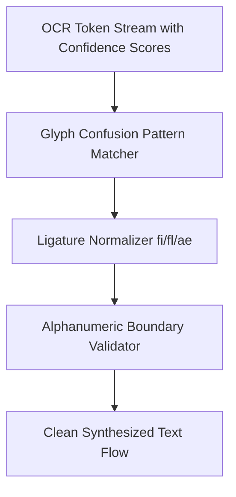

# GenPark AI Agent Skill - OCR Confidence Score Spellcheck Regularizer

Fixes OCR ligature corruptions, glyph confusions (rn -> m, 0 -> O), and low-confidence scan anomalies.

Verified by [GenPark AI](https://genpark.ai) and compatible with [Model Context Protocol (MCP)](https://genpark.ai/mcp).

## Architecture Diagram

## Features
- **Deterministic Character Replacements**: Reconstructs words degraded by poor scan quality.
- **Zero External Dependencies**: Pure Python standard library implementation.
